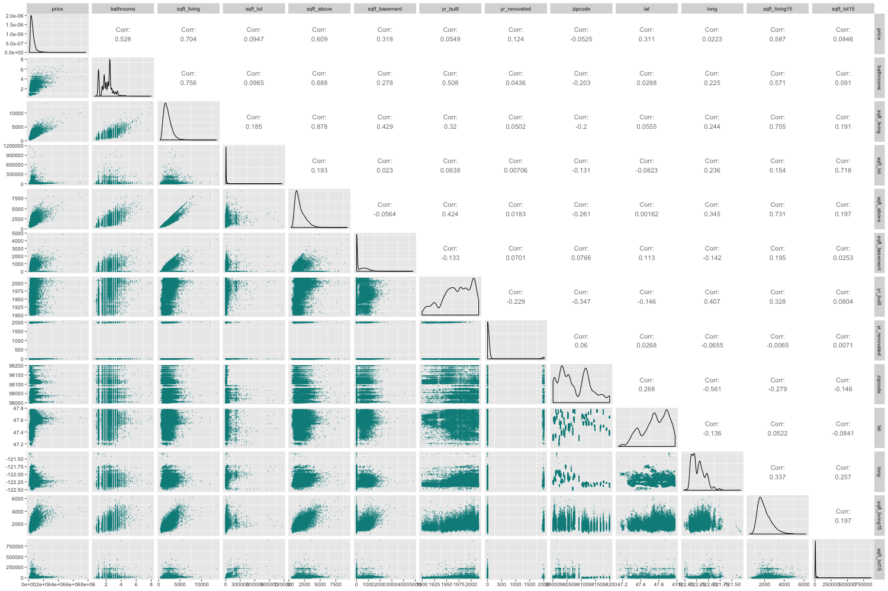

```{r setup, include=FALSE}
knitr::opts_chunk$set(echo = TRUE)
```

```{r Load Libraries, echo = FALSE, include = FALSE}
source('scripts/install_packages.R')

if (is.null(webshot:::find_phantom())) {
  webshot::install_phantomjs()
}
```

``` {r Load Prepared Data, echo = FALSE}
load('data_output/RMarkdown_Objects.RData')
```

``` {r Plot Residuals Function, echo = FALSE}
plot_residuals <- function (residuals, title = '') {
  p1 <- ggplot(as.data.frame(residuals),
               aes(x = seq_along(residuals), y = residuals)) +
    geom_point(color = 'darkcyan', size = 0.5) +
    theme_minimal() +
    theme(legend.position = 'none') +
    labs(x = 'Scatterplot', y = '')
  
  p2 <- ggplot(as.data.frame(residuals),
               aes(x = residuals)) +
    geom_histogram(fill = 'darkcyan', bins = 100) +
    theme_minimal() +
    theme(legend.position = 'none') +
    labs(x = 'Histogram', y = '')
  
  p3 <- ggplot(as.data.frame(residuals),
               aes(y = residuals)) +
    geom_boxplot(color = 'darkcyan') +
    theme_minimal() +
    theme(legend.position = 'none') +
    labs(x = 'Boxplot', y = '')
  
  p4 <- ggplot(as.data.frame(residuals),
               aes(sample = residuals)) +
    geom_qq(color = 'darkcyan', size = 0.5) +
    theme_minimal() +
    theme(legend.position = 'none') +
    labs(x = 'QQplot', y = '')
  
  grobs <- list()
  grobs[[1]] <- p1
  grobs[[2]] <- p2
  grobs[[3]] <- p3
  grobs[[4]] <- p4
  grid.arrange(
    grobs = grobs,
    nrow = 2,
    ncol = 2,
    top = ifelse(title != '', paste0('Residuals of ', title), 'Residuals')
  )
}
```

</br>

***

## King County House Sales Dataset  

The *King County House Sales* dataset contains the **house sales around Seattle, in King County (USA), between May 2014 and May 2015**. The original dataset can be found on [Kaggle](https://www.kaggle.com/harlfoxem/housesalesprediction).  

All the files of this project are saved in a [GitHub repository](https://github.com/ashomah/King-County-House-Sales).  

The dataset consists in:  

* **Train Set** with 17,277 observations with 19 house features, the ID, and the price.  
* **Test Set** with 4,320 observations with 19 house features and the ID. The `price` column will be added to the Test Set, with NAs, to ease the pre-processing stage.  

This map shows where the properties listed in the dataset are located:  

```{r Map, echo=FALSE, fig.height=8, fig.width=10, fig.align='center', warning=FALSE}
load('data_output/hp_map_9_terrain.rda')

ggmap(hp_map_9_terrain) +
  labs(x = '', y = '') +
  theme(legend.position = 'none') +
  geom_point(data = long_lat,
             aes(x = long, y = lat),
             colour = 'darkcyan',
             size = 0.5)
```

This project aims to predict house prices based on their features.  

</br>

***

## Packages  

This analysis requires these R packages:  

* Data Manipulation: `data.table`, `dplyr`, `tibble`, `tidyr`  
    
* Plotting: `corrplot`, `GGally`, `ggmap`, `ggplot2`, `grid`, `gridExtra`  
    
* Machine Learning: `caret`, `dbscan`, `glmnet`, `leaderCluster`, `MLmetrics`, `ranger`, `xgboost`  

* Multithreading: `doMC`, `doParallel`, `factoextra`, `foreach`, `parallel`  

* Reporting: `kableExtra`, `knitr`, `RColorBrewer`, `shiny`, and... `beepr`.  

These packages are installed and loaded if necessary by the main script.

</br>

***
 
## Data Preparation  

The dataset is pretty clean, with no missing value in both Train and Test sets. A quick look at the `id` values also shows that only a few houses have been sold more than once on the period, so it doesn't seem relevant the consider the `id` and the `date` for this analysis. We will thus **focus on the house features** to predict its price.  

``` {r NAs and id, echo = FALSE, collapse=TRUE}
# Check if contains NAs ----
na_count <-
  sapply(raw_hp_train, function(y)
    sum(length(which(is.na(
      y
    )))))
na_count <- data.frame(na_count)
na_count$perc <- round(na_count$na_count / nrow(hp_train) * 100, 2)
print(paste0(nrow(na_count[na_count$na_count != 0,]), ' columns of the Train Set have NAs.'))

na_count <-
  sapply(raw_hp_test, function(y)
    sum(length(which(is.na(
      y
    )))))
na_count <- data.frame(na_count)
na_count$perc <- round(na_count$na_count / nrow(hp_test) * 100, 2)
print(paste0(nrow(na_count[na_count$na_count != 0,]), ' columns of the Test Set have NAs.'))


# Check if house IDs are relevant ----
print(
  paste0(
    houses_sold_multi_times_train,
    ' houses sold more than once on the period, for a total of ',
    houses_train,
    ' houses in the Train Set (',
    round(houses_sold_multi_times_train / houses_train, 3),
    '%).'
  )
)

print(
  paste0(
    houses_sold_multi_times_test,
    ' houses in the Test Set sold more than once on the period, for a total of ',
    houses_test,
    ' houses in the Test Set (',
    round(houses_sold_multi_times_test / houses_test, 3),
    '%).'
  )
)
```

</br>

Some of the features can be converted into factors, as they are not continuous and help categorizing the house:  

* `waterfront` is a boolean, indicating if the house has a view to a waterfront.  
* `view` indicated the number of times the house has been viewed. As it only has 4 values, this feature can be factorized.  
* `condition` is a score from 1 to 5, indicating the state of the house.  
* `grade` is another score, with 11 levels.  
* `bedrooms` is typically used to categorize houses.  

</br>

The package `caret` automatically one-hot encodes the categorical features when fitting a model. Due to their number of unique values, these features won't be factorized at first:  

* `bathrooms` could also be used to categorize the houses, although it is not clear why the data shows decimal numbers.  
* `zipcode` is a cluster-like category of the house location.  

The impact of processing them as factors will be tested with a Linear Regression.  

</br>

***

## Exploratory Data Analysis  

The target of this analysis is the `price` of the houses. Like the real estate market, the `price` variable is highly right-skewed, with its maximum value being more than 10 times larger than the 3rd quartile:  

```{r Price Summary, echo=FALSE, fig.height=8, fig.width=10, fig.align='center', warning=FALSE}
summary(hp_train$price)
```

```{r Price, echo=FALSE, fig.height=8, fig.width=10, fig.align='center', warning=FALSE}
g1 <- ggplot(hp_train,
             aes(x = hp_train[, 'price'])) +
  geom_density(color = 'darkcyan', fill = 'darkcyan') +
  theme_minimal() +
  theme(
    legend.position = 'none',
    plot.title = element_text(hjust = 0.5,
                              size = 12,
                              face = 'bold')
  ) +
  labs(x = '',
       y = 'Density',
       title = paste0(toupper(substr('price', 1, 1)), tolower(substr(
         'price', 2, nchar('price')
       ))))

g2 <- ggplot(hp_train,
             aes(y = hp_train[, 'price'])) +
  geom_boxplot(color = 'darkcyan') +
  theme_minimal() +
  theme(legend.position = 'none') +
  labs(x = '', y = 'House Price') +
  coord_flip()

grobs <- list()
grobs[[1]] <- g1
grobs[[2]] <- g2
grid.arrange(grobs = grobs)
```

</br>

These properties of high-value cannot be removed from the dataset, as they are not anomalies but examples of the luxury market in the region. By transforming the data with a logarithm to base 10, it is possible to easily rebalance the dataset. This transformation could be used later to try to improve our models' performance.  

```{r Log Price, echo=FALSE, fig.height=8, fig.width=10, fig.align='center', warning=FALSE}
g1 <- ggplot(hp_train,
             aes(x = log10(hp_train[, 'price']))) +
  geom_density(color = 'darkcyan', fill = 'darkcyan') +
  theme_minimal() +
  theme(
    legend.position = 'none',
    plot.title = element_text(hjust = 0.5,
                              size = 12,
                              face = 'bold')
  ) +
  labs(x = '',
       y = 'Density',
       title = paste0(toupper(substr('log10 price', 1, 1)), tolower(substr(
         'log10 price', 2, nchar('log10 price')
       ))))

g2 <- ggplot(hp_train,
             aes(y = log10(hp_train[, 'price']))) +
  geom_boxplot(color = 'darkcyan') +
  theme_minimal() +
  theme(legend.position = 'none') +
  labs(x = '', y = 'House Price') +
  coord_flip()

grobs <- list()
grobs[[1]] <- g1
grobs[[2]] <- g2
grid.arrange(grobs = grobs)
```

</br>

The Correlation Matrix between the numerical features of the Train Set indicates some correlation between the `price` and:  

* `sqft_living`: more living area logically implies a higher price.  
* `sqft_living15`: the living area in 2015 is also linked to the current price. Recent renovations have modified the living area, but it is likely that the house stays in a similar price range.  
* `sqft_above`: by definition, the area above ground is related to the living area. It is not a surprice to see correlation with the price as well.  
* `bathrooms`: interestingly, the number of bathrooms seems to slightly correlate with the price.  

Some other relationships can be identified:  

* the `sqft_` features are linked to each others, as `sqft_living = sqft_above + sqft_basement`, and the lot areas are usually not changing much within a year.  
* the `zipcode` and the `long`itude are quite linked, maybe due to the way zipcode have been designed in the region.  

```{r Correlation Matrix, echo=FALSE, fig.height=8, fig.width=10, fig.align='center', warning=FALSE}
corrplot.mixed(cor(hp_train[, names(hp_train)[sapply(hp_train, is.numeric)]]), order = 'FPC', tl.cex = 0.55)
```

</br>

This other Correlation Matrix provides another view of the relationship between features, as well as their own distribution.  



</br>

The following charts allow to understand the structure of each factor feature:  

* A majority of houses in the region have 3 or 4 bedrooms. An overall trend shows that more bedrooms means higher prices.  
* Most of the houses in the region are in an average condition `3`, with 26% of the houses being in a great condition `4`, and 8% being in an exceptional condition `5`.  
* The real estate market in the region seems to offer almost as many houses with two floors than with one floor.  
* The grade distribution is similar than the condition (with more levels), but the relation to price looks clearer.  
* Houses with more views seem to be in a higher price range.  
* Houses with a view the waterfront are clearly more expensive than the ones without.  


``` {r Factor Features, echo=FALSE, message = FALSE, fig.align = 'center'}
if (params$shiny == FALSE) {
  for (feature in names(hp_train)[sapply(hp_train, is.factor)]) {
    g1 <- ggplot(hp_train,
                 aes(x = hp_train[, feature])) +
      geom_bar(color = 'darkcyan', fill = 'darkcyan') +
      theme_minimal() +
      theme(
        legend.position = 'none',
        plot.title = element_text(
          hjust = 0.5,
          size = 12,
          face = 'bold'
        )
      ) +
      labs(x = '',
           y = 'Count',
           title = paste0(toupper(substr(feature, 1, 1)), tolower(substr(
             feature, 2, nchar(feature)
           ))))
    
    g2 <- ggplot(hp_train,
                 aes(x = hp_train[, feature], y = log(price))) +
      geom_boxplot(color = 'darkcyan', size = 0.5) +
      theme_minimal() +
      theme(legend.position = 'none') +
      labs(x = '', y = 'House Price')
    
    grobs <- list()
    grobs[[1]] <- g1
    grobs[[2]] <- g2
    grid.arrange(grobs = grobs)
  }
} else {
  shinyApp(
    ui = fluidPage(fluidRow(
      selectInput(
        inputId = 'feature',
        label = 'Factor Feature',
        choices = sort(names(hp_train)[sapply(hp_train, is.factor)]),
        selected = 'bedrooms'
      )
    ),
    fluidRow(plotOutput('plot'))),
    
    server = function(input, output) {
      output$plot <- renderPlot({
        g1 <- ggplot(hp_train,
                     aes(x = hp_train[, input$feature])) +
          geom_bar(color = 'darkcyan', fill = 'darkcyan') +
          theme_minimal() +
          labs(x = input$feature, y = 'Count')
        
        g2 <- ggplot(hp_train,
                     aes(x = hp_train[, input$feature], y = log(price))) +
          geom_boxplot(color = 'darkcyan') +
          theme_minimal() +
          theme(legend.position = 'none') +
          labs(x = input$feature, y = 'House Price')
        
        grobs <- list()
        grobs[[1]] <- g1
        grobs[[2]] <- g2
        grid.arrange(grobs = grobs)
      })
    },
    
    options = list(height = 500)
  )
}
```

</br>

The following charts describe the numercial features and provide interesting insights:  

* The number of `bathrooms` is difficult to interpret without knowing the meaning of the decimals. But it seems that majority of houses have values of 2.5 and 1.  
* The latitude and longitude distributions suggest a higher number of properties in the North-West of the region.  
* The floor space is also right-skewed, with a large portion of the houses having no basement.  
* Looking at the distribution of the feature `yr_built`, we can observe a regular increase of real estate projects since the early years of the 20th century. This trend can certainly be related to the population growth and the urban development in the region over the years.  
* With only `r length(hp_train$yr_renovated[hp_train$yr_renovated!=0])` properties with renovation records, the `yr_renovated` feature is extremely right-skewed. If we consider only the properties with records, renovations go from `r summary(hp_train$yr_renovated[hp_train$yr_renovated!=0])[1]` till `r summary(hp_train$yr_renovated[hp_train$yr_renovated!=0])[6]`, with higher numbers from the 80s, and a big wave of renovations in 2013 and 2014.  
* Houses in the dataset seem quite well distributed across the `zipcode` range, although it is difficult to comment this feature without a good knowlegde of the region and the structure of the zipcode system.  

``` {r Numerical Features, echo=FALSE, message = FALSE, fig.align = 'center'}
if (params$shiny == FALSE) {
  for (feature in names(hp_train)[sapply(hp_train, is.numeric)]) {
    g1 <- ggplot(hp_train,
                 aes(x = hp_train[, feature])) +
      geom_density(color = 'darkcyan', fill = 'darkcyan') +
      theme_minimal() +
      theme(
        legend.position = 'none',
        plot.title = element_text(
          hjust = 0.5,
          size = 12,
          face = 'bold'
        )
      ) +
      labs(x = '',
           y = 'Density',
           title = paste0(toupper(substr(feature, 1, 1)), tolower(substr(
             feature, 2, nchar(feature)
           ))))
    
    g2 <- ggplot(hp_train,
                 aes(x = hp_train[, feature], y = price)) +
      geom_point(color = 'darkcyan', size = 0.5) +
      theme_minimal() +
      theme(legend.position = 'none') +
      labs(x = '', y = 'House Price')
    
    grobs <- list()
    grobs[[1]] <- g1
    grobs[[2]] <- g2
    grid.arrange(grobs = grobs)
  }
} else {
  shinyApp(
    ui = fluidPage(fluidRow(
      selectInput(
        inputId = 'feature',
        label = 'Numerical Feature',
        choices = sort(names(hp_train[, names(hp_train) != 'price'])[sapply(hp_train[, names(hp_train) != 'price'], is.numeric)]),
        selected = 'sqft_living'
      )
    ),
    fluidRow(plotOutput('plot'))),
    
    server = function(input, output) {
      output$plot <- renderPlot({
        g1 <- ggplot(hp_train,
                     aes(x = hp_train[, input$feature])) +
          geom_density(color = 'darkcyan', fill = 'darkcyan') +
          theme_minimal() +
          theme(
            legend.position = 'none',
            plot.title = element_text(
              hjust = 0.5,
              size = 12,
              face = 'bold'
            )
          ) +
          labs(x = '',
               y = 'Density',
               title = paste0(toupper(substr(
                 input$feature, 1, 1
               )), tolower(substr(
                 input$feature, 2, nchar(input$feature)
               ))))
        
        g2 <- ggplot(hp_train,
                     aes(x = hp_train[, input$feature], y = price)) +
          geom_point(color = 'darkcyan', size = 0.5) +
          theme_minimal() +
          theme(legend.position = 'none') +
          labs(x = '', y = 'House Price')
        
        grobs <- list()
        grobs[[1]] <- g1
        grobs[[2]] <- g2
        grid.arrange(grobs = grobs)
      })
    },
    
    options = list(height = 500)
  )
}
```

</br>

***

## Data Preparation  

As the Test Set doesn't contain the feature `price`, it is necessary to randomly split the Train Set in two, with a 80|20 ratio:  

* **Train Set A**, which will be used to train our model.  
* **Train Set B**, which will be used to test our model and validate the performance of the model.  

These datasets are centered and scaled, using the `preProcess` function of the package `caret`. These transformations should improve the performance of linear models.  

Copies of these datasets are prepared with the features `bathrooms` and `zipcode` set as factors, and other copies with the `price` being transformed with `log10`. These versions of the datasets will allow to test the response of our models to different inputs.  

</br>

***

## Cross-Validation Strategy  

To validate the stability of our models, we will apply a 10-fold cross-validation, repeated 3 times.  

</br>

***

## Baseline  

At first, we use the **linear regression** algorithm to fit models on different dataset configurations:  

* The prepared datasets, without additional transformation,  
* The prepared datasets with `price` being transformed with log10,  
* The prepared datasets with `bathrooms` and `zipcode` as factors,  
* The prepared datasets with both transformations.  

``` {r Baseline Results, echo=FALSE, message = FALSE, fig.align = 'center'}
all_real_results[1:4,] %>%
  rownames_to_column('model') %>%
  mutate(
    MAPE = cell_spec(
      format(MAPE, nsmall = 7),
      color = ifelse(rank(MAPE) <= 1, 'white', 'ghostwhite'),
      font_size = ifelse(rank(MAPE) <= 1, 12, 11),
      background = spec_color(
        rank(MAPE),
        option = 'D',
        begin = 0.50,
        end = 0.98,
        direction = 1
      ),
      bold = ifelse(rank(MAPE) <= 1, TRUE, FALSE)
    )
  ) %>%
  kable(escape = FALSE, align = 'r') %>% kable_styling(bootstrap_options = c('hover', 'condensed'))
```

The two transformations appear to improve the performance of the model, both individually and jointly. The log10 helps by centering the 'price' and reduce the influence of high values. The class change of `bathrooms` and `zipcode` avoids the model to consider them as ordinal features, which is particularly useful for `zipcode` which characterizes house clusters.  

</br>

We continue by training models with a **random forest** using the package `ranger`, then with an **eXtreme Gradient BOOSTing** (XGBoost), both on the four possible combinations of transformations.  

``` {r Baseline Results with Ranger and XGB, echo=FALSE, message = FALSE, fig.align = 'center'}
all_real_results[1:12,] %>%
  rownames_to_column('model') %>%
  mutate(
    MAPE = cell_spec(
      format(MAPE, nsmall = 7),
      color = ifelse(rank(MAPE) <= 3, 'white', 'ghostwhite'),
      font_size = ifelse(rank(MAPE) <= 3, 12, 11),
      background = spec_color(
        rank(MAPE),
        option = 'D',
        begin = 0.50,
        end = 0.98,
        direction = 1
      ),
      bold = ifelse(rank(MAPE) <= 3, TRUE, FALSE)
    )
  ) %>%
  column_to_rownames('model') %>%
  kable(escape = FALSE, align = 'r') %>% kable_styling(bootstrap_options = c('hover', 'condensed'))
```

These results confirm our previous conclusions:  

* the log10 transformation has a great impact on the model performance. It will be kept for next models.  
* the class change of `bathrooms` and `zipcode` has lower impact, but still improves the results.  

Looking at the algorithm performances, *Ranger* has slighlty better results than *XGBoost*, but the calculation time being significantly longer for *Ranger*, we will continue with *XGBoost* only.  

</br>

***

## Feature Engineering  

### House Age and Renovation  

A few features can be developped, focusing on the `yr_built` and `yr_renovated` of the house:  

* `house_age`: the difference between the `yr_built` and 2015 gives the age of the house.  
* `house_age_since_renovation`: the difference between the `yr_renovated` and 2015 indicates since how many years the house hasn't been renovated.  
* `renovated`: a boolean flag indicating if the house has been renovated at least once.  

</br>

### Clusters  

Another element which might influence the price of a house is the dynamism of the market in the area. Some neighborhoods are more in demand than others, either because of the price or because of the reputation.  Thus, it would be interesting to add a feature that considers the density of house sales in the area.  

This hexagonal binning map shows the areas with high density of house sales, which are mainly located in the North-West of the region. Some other hotspots can be found in the eastern area too.  

```{r Density Map, echo=FALSE, fig.height=8, fig.width=10, fig.align='center', warning=FALSE, message=FALSE}
load('data_output/hp_map_10_terrain.rda')

ggmap(hp_map_10_terrain) +
  labs(x = '', y = '') +
  theme(legend.position = 'none') +
  # scale_colour_hue(h.start = 10, c=120, na.value = 'grey') +
  coord_fixed(ratio = 3.07 / 2, expand = FALSE) +
  geom_hex(data = long_lat, aes(x = long, y = lat), bins = 50) +
  # geom_point(data = long_lat, aes(x = long, y = lat), size = 0.3, color = 'white') +
  stat_density2d(
    data = long_lat,
    aes(x = long, y = lat),
    contour = TRUE,
    geom = 'density_2d',
    bins = 15,
    color = 'black',
    size = 0.6,
    alpha = 0.7
  )
```

</br>

To identify areas of high house sales density, we will use the clustering algorithm **DBSCAN** (Density-Based Spatial Clustering of Application with Noise) from the package `dbscan`. This algorithm groups points that are closely packed together, and marks as outliers the points that lie alone in low-density regions.  

This algorithm requires two parameters:  

* `eps` - *epsilon*: defines the radius of neigborhood around a point `x` (reachability maximum distance).  
* `minPts`: defines the minimum number of neighbors within epsilon radius. If the point `x` is not surrounded by `minPts` neighbors, it is considered as an outlier.  

After multiple trials, it appeared that the parameters providing a maximum number of relevant clusters were `eps = 0.0114` and `minPts = 50`. This plot shows which areas have been defined as high-density clusters, using the Train Set A.  

```{r Cluster Raw, echo=FALSE, fig.height=8, fig.width=10, fig.align='center', warning=FALSE}
fviz_cluster(dbscan_clusters_train_A, hp_train_A[, c('long', 'lat')], stand = FALSE, frame = FALSE, geom = "point", pointsize = 0.5, main = '', ggtheme = theme_minimal()) +
  theme(legend.position = 'none')
```

</br>

The clusters now being found based on *Train Set A*, we can asociate them to the points of *Train Set B*. The maps below allow to compare the results and confirm that the points of *Train Set B* are assigned to the right cluster.  

```{r Cluster A, echo=FALSE, fig.height=8, fig.width=10, fig.align='center', warning=FALSE}
ggmap(hp_map_10_terrain) +
  labs(x = '', y = '', title = 'Train Set A') +
  theme(legend.position = 'none') +
  scale_colour_hue(h.start = 10,
                   c = 120,
                   na.value = 'grey') +
  geom_point(data = cluster_plot_A,
             aes(x = long, y = lat, colour = cluster),
             size = 1) +
  stat_density2d(
    data = hp_train_A,
    aes(x = long, y = lat),
    contour = TRUE,
    geom = 'density_2d',
    bins = 15,
    color = 'black', size = 0.6, alpha = 0.7)
```

```{r Cluster B, echo=FALSE, fig.height=8, fig.width=10, fig.align='center', warning=FALSE, message=FALSE}
ggmap(hp_map_10_terrain) +
  labs(x = '', y = '', title = 'Train Set B') +
  theme(legend.position = 'none') +
  scale_colour_hue(h.start = 10,
                   c = 120,
                   na.value = 'grey') +
  geom_point(data = cluster_plot_B,
             aes(x = long, y = lat, colour = cluster),
             size = 1) +
  stat_density2d(
    data = hp_train_A,
    aes(x = long, y = lat),
    contour = TRUE,
    geom = 'density_2d',
    bins = 15,
    color = 'black', size = 0.6, alpha = 0.7)
```

</br>

With these new features, we can train a new model and compare the results with the previous ones.  

``` {r Baseline Results with FE, echo=FALSE, message = FALSE, fig.align = 'center'}
to_display <-
  all_real_results[rownames(all_real_results) %in% c(
    'Baseline Ranger Log All Fact',
    'Baseline Ranger Log',
    'Baseline XGBoost Log All Fact',
    'FE XGBoost'
  ),]

to_display %>%
  rownames_to_column('model') %>%
  mutate(
    MAPE = cell_spec(
      format(MAPE, nsmall = 7),
      color = ifelse(rank(MAPE) <= 3, 'white', 'ghostwhite'),
      font_size = ifelse(rank(MAPE) <= 3, 12, 11),
      background = spec_color(
        rank(MAPE),
        option = 'D',
        begin = 0.50,
        end = 0.98,
        direction = 1
      ),
      bold = ifelse(rank(MAPE) <= 3, TRUE, FALSE)
    )
  ) %>%
  column_to_rownames('model') %>%
  kable(escape = FALSE, align = 'r') %>% kable_styling(bootstrap_options = c('hover', 'condensed'))
```

</br>

The new model obtains a reasonable result, although it didn't beat the two best models.  

</br>

***

## Feature Selection with Lasso and RFE  

We can compare the Top 20 feature importances for the 4 best models, and observe some similarities:  

* `lat` and `long` appear in all four Top 20, with `lat` having a really high importance. It might indicate that the house prices depend a lot on the location on the North-South axis.  
* `sqft_living` and its related features `sqft_above`, `sqft_living15` are also at the top of the list, which is not really surprising.  
* `grade` values are important, especially the higher ones. It might indicate that higher grades have a significant impact on the house price.  
* `yr_built` usually appears at the first tier of the Top 20s.  
* As a great indicator of the house location, the `zipcode` seems to have some kind of importance. `zipcode98004` and `zipcode98112` in particular appear in the Top 20. These neighborhoods might have specific characteristics which influence the prices.  
* `waterfront` appears in the four Top 20, which might be a great add-value for properties in this area.  
* `condition3`, which indicate that the house in a fair condition, seems to impact the price as well.  
* `view4` has also an influence on the price. It could indicate lower prices, due to the difficulty to find a buyer. Or in the opposite, it could indicate prices higher than the market. A better look at the models structures will give us better insights.  

``` {r VarImp, echo=FALSE, message = FALSE, fig.height=8, fig.width=10, fig.align='center'}
g1 <- ggplot(varImp(hp_fit_baseline_ranger_log),
             top = 20,
             aes(x = Importance, y = Feature)) +
  geom_bar(stat = 'identity', fill = 'darkcyan') +
  theme_minimal() +
  labs(title = 'Baseline Ranger Log', x = '', y = '')

g2 <-
  ggplot(varImp(hp_fit_baseline_ranger_log_all_fact),
         top = 20,
         aes(x = Importance, y = Feature)) +
  geom_bar(stat = 'identity', fill = 'darkcyan') +
  theme_minimal() +
  labs(title = 'Baseline Ranger Log All Fact', x = '', y = '')

g3 <-
  ggplot(varImp(hp_fit_baseline_xgb_log_all_fact),
         top = 20,
         aes(x = Importance, y = Feature)) +
  geom_bar(stat = 'identity', fill = 'darkcyan') +
  theme_minimal() +
  labs(title = 'Baseline XGBoost Log All Fact', x = '', y = '')

g4 <-
  ggplot(varImp(hp_fit_xgb_FE), top = 20, aes(x = Importance, y = Feature)) +
  geom_bar(stat = 'identity', fill = 'darkcyan') +
  theme_minimal() +
  labs(title = 'FE XGBoost', x = '', y = '')

grobs <- list()
grobs[[1]] <- g1
grobs[[2]] <- g2
grobs[[3]] <- g3
grobs[[4]] <- g4
grid.arrange(grobs = grobs, ncol = 2, nrow = 2, layout_matrix = rbind(c(1,2), c(3,4)))
```

</br>

### Lasso Regression  

With `r length(hp_fit_xgb_FE$coefnames)` features, the model resulting from the Feature Engineering stage is quite complex and would benefit from cutting down its number of variables. Also, only a few parameters seem to have a real importance for the model result. Thus, we will start our trimming process with a **Lasso Regression** which is forcing the coefficients with minor contribution to be equal to 0. We will then get a list of features that we can ignore for our model.  

``` {r Lasso, echo=FALSE, message = FALSE, fig.height=8, fig.width=10, fig.align='center', collapse = TRUE}
print(
  paste0(
    'The Lasso Regression selected ',
    length(varsSelected),
    ' variables, and rejected ',
    length(varsNotSelected),
    ' variables.'
  )
)

kable(data.frame(matrix(
  varsNotSelected, nrow = 3, ncol = 4
)),
col.names = c('Rejected Features', '', '', ''),
align = 'l') %>% kable_styling(bootstrap_options = c('hover', 'condensed'))
```

</br>

We can note that the new feature `renovated` has been rejected all together. Large values of `bathrooms` also don't seem to have any impact on the price.  

</br>

### Recursive Feature Elimination  

The dataset being lightened from a few features, we continue the feature selection using a **RFE** (Recursive Feature Elimination), which will test the variable importances for models trained on subsets with predefined number of variables. This should help to reduce the number of variables with a low impact on the model performance.  

For this RFE, we use *Random Forest* algorithms and *5-fold Cross-Validation*. This chart shows the RMSE obtained for each iteration of the RFE.  

###### *Note: the RMSE hasn't been rescaled, which explains the difference with the table of model results.*  

```{r RFE Results, echo=FALSE, fig.height=8, fig.width=10, fig.align='center', warning=FALSE}
ggplot(results_rfe) +
  geom_line(color = 'darkcyan', fill = 'darkcyan') +
  geom_point(color = 'darkcyan') +
  labs(x = 'Number of Variables') +
  theme_minimal()
```

</br>

Although we can't observe any clear 'knee', which would indicate that many features could be eliminated with a low impact on the model performance, we could expect to get a fair result for subsets of 40 to 60 features. It is here difficult to estimate the impact on the metrics, as the RMSE shown here is re-scalled.  

If we look at the variables importance, we can see that 4 features have a great impact on the model performance, while the importance then decreases slowly to be almost insignificant after the 25th feature.  

``` {r VarImp RFE, echo=FALSE, message = FALSE, fig.height=8, fig.width=10, fig.align='center'}
ggplot(tail(varImp_rfe, 50), aes(x = reorder(Variables, Importance), y = Importance)) +
  geom_bar(stat = 'identity', fill = 'darkcyan') +
  coord_flip() +
  theme_minimal() +
  labs(y = 'Importance', x = 'Top 50 Features')
```

</br>

By defining an arbitrary threshold, we can filter the features with low importance. We decide that features that have an importance less than 0.1% overall should be eliminated. We end up with a list of `r nrow(var_sel_rfe)` features which cumulate `r round(sum(var_sel_rfe$perc),1)`% of the variable importances. We can expect a low impact on the model performance, which could be recaptured with model fine tuning.  

``` {r RFE Variables, echo=FALSE, message = FALSE, fig.height=8, fig.width=10, fig.align='center', collapse = TRUE}
kable(
  data.frame(matrix(
    c(as.vector(var_sel_rfe$Variables), '', '', ''),
    nrow = 8,
    ncol = 5,
    byrow = TRUE
  )),
  col.names = c('Selected Features', '', '', '', ''),
  align = 'l'
) %>%
  kable_styling(bootstrap_options = c('hover', 'condensed'))
```

</br>

Using this list of selected features, we can re-train an **XGBoost** model and compare it with previous results.  

``` {r Results Post RFE, echo=FALSE, message = FALSE, fig.align = 'center'}
to_display <-
  all_real_results[rownames(all_real_results) %in% c(
    'Baseline Ranger Log All Fact',
    'Baseline Ranger Log',
    'Baseline XGBoost Log All Fact',
    'FE XGBoost',
    'XGBoost Post RFE'
  ),]

to_display %>%
  rownames_to_column('model') %>%
  mutate(
    MAPE = cell_spec(
      format(MAPE, nsmall = 7),
      color = ifelse(rank(MAPE) <= 3, 'white', 'ghostwhite'),
      font_size = ifelse(rank(MAPE) <= 3, 12, 11),
      background = spec_color(
        rank(MAPE),
        option = 'D',
        begin = 0.50,
        end = 0.98,
        direction = 1
      ),
      bold = ifelse(rank(MAPE) <= 3, TRUE, FALSE)
    )
  ) %>%
  kable(escape = FALSE, align = 'r') %>% kable_styling(bootstrap_options = c('hover', 'condensed'))
```

</br>

The performance of the model post-RFE is not as good as the previous models, but with only `r nrow(var_sel_rfe)` features, it is still a very good score! We should be able to catch-up on results with some model tuning.  

</br>

***

## Tuning  

After subsetting the features selected by the Lasso and RFE steps, we proceed to model tuning on a **XGBoost** and a **Ranger**, to see which one provides the best results.  

Starting with the *XGBoost*, we use a *Tune Grid* to fine best combination of parameters.  

``` {r XGB Parameters, echo=FALSE, message = FALSE, fig.height=8, fig.width=10, fig.align='center', collapse = TRUE}
plot(hp_fit_xgb_tuning)
```

</br>

These charts don't reveal any opportunity to easily improve the result of the parameters we already tested. Thus, we can approve the best model from this search, which used these parameters:  

``` {r Best XGB Tune, echo=FALSE, message = FALSE, fig.height=8, fig.width=10, fig.align='center', collapse = TRUE}
kable(mutate(hp_fit_xgb_tuning$bestTune), align = 'c') %>% 
  kable_styling(bootstrap_options = c('hover', 'condensed'))
```

</br>

Trying now with a *Ranger* algorithm, which provided really good results before Feature Engineering.  

``` {r Ranger Parameters, echo=FALSE, message = FALSE, fig.height=8, fig.width=10, fig.align='center', collapse = TRUE}
plot(hp_fit_ranger_tuning)
```

</br>

These charts don't reveal any opportunity to easily improve the result. We might actually  have pushed a bit much on the `mtry` parameter. Anyway, we can approve the best model from this search, which used these parameters:  

``` {r Best Ranger Tune, echo=FALSE, message = FALSE, fig.height=8, fig.width=10, fig.align='center', collapse = TRUE}
kable(mutate(hp_fit_ranger_tuning$bestTune), align = 'c') %>%
  kable_styling(bootstrap_options = c('hover', 'condensed'))
```

</br>

Let's compare these two new models with the previous best ones.  

``` {r Results Tuning, echo=FALSE, message = FALSE, fig.align = 'center'}
to_display <-
  all_real_results[rownames(all_real_results) %in% c(
    'Baseline Ranger Log All Fact',
    'Baseline Ranger Log',
    'Baseline XGBoost Log All Fact',
    'FE XGBoost',
    'XGBoost Post RFE',
    'Tuning XGBoost',
    'Tuning Ranger'
  ),]

to_display %>%
  rownames_to_column('model') %>%
  mutate(
    MAPE = cell_spec(
      format(MAPE, nsmall = 7),
      color = ifelse(rank(MAPE) <= 3, 'white', 'ghostwhite'),
      font_size = ifelse(rank(MAPE) <= 3, 12, 11),
      background = spec_color(
        rank(MAPE),
        option = 'D',
        begin = 0.50,
        end = 0.98,
        direction = 1
      ),
      bold = ifelse(rank(MAPE) <= 3, TRUE, FALSE)
    )
  ) %>%
  kable(escape = FALSE, align = 'r') %>% kable_styling(bootstrap_options = c('hover', 'condensed'))
```

</br>

The **Tuned XGBoost** performs very well, outperforming the previous records! The Tuned Ranger, on the other hand, is a bit disappointing, as it is actually worse than the *Baseline Ranger with Log10(`price`)*...  

</br>

***

## Final Model  

The best model for this analysis is the **Tuned XGBoost**, which reaches the *MAPE* score of `r all_real_results['Tuning XGBoost','MAPE']` with only `r nrow(var_sel_rfe)` features.  

``` {r Best Model, echo=FALSE, message = FALSE, fig.align = 'center'}
to_display <-
  all_real_results[rownames(all_real_results) %in% c('Tuning XGBoost'),]

to_display %>%
  rownames_to_column('model') %>%
  mutate(
    MAPE = cell_spec(
      format(MAPE, nsmall = 7),
      color = ifelse(rank(MAPE) <= 3, 'white', 'ghostwhite'),
      font_size = ifelse(rank(MAPE) <= 3, 12, 11),
      background = spec_color(
        rank(MAPE),
        option = 'D',
        begin = 0.50,
        end = 0.98,
        direction = 1
      ),
      bold = ifelse(rank(MAPE) <= 3, TRUE, FALSE)
    )
  ) %>%
  kable(escape = FALSE, align = 'r') %>% kable_styling(bootstrap_options = c('hover', 'condensed'))
```

The model uses these parameters:  

``` {r Best Model Parameters, echo=FALSE, message = FALSE, fig.height=8, fig.width=10, fig.align='center', collapse = TRUE}
kable(mutate(hp_fit_xgb_tuning$bestTune), align = 'c') %>%
  kable_styling(bootstrap_options = c('hover', 'condensed'))
```

</br>

The model needs these features as input:  

``` {r Best Models Variables, echo=FALSE, message = FALSE, fig.height=8, fig.width=10, fig.align='center', collapse = TRUE}
kable(
  data.frame(matrix(
    c(as.vector(var_sel_rfe$Variables), '', '', ''),
    nrow = 8,
    ncol = 5,
    byrow = TRUE
  )),
  col.names = c('Features', '', '', '', ''),
  align = 'l'
) %>%
  kable_styling(bootstrap_options = c('hover', 'condensed'))
```

</br>

Comparing the predictions of our model with the actual values of the *Train Set B* would provide an idea of its limitations. We can notice that the model has **difficulties to predict prices between 0.75 and 1 million dollars**. Further work on Feature Engineering might be able to improve the results in this area.    

``` {r Density Comparison, echo=FALSE, message = FALSE, fig.height=8, fig.width=10, fig.align='center', collapse = TRUE}
ggplot(data.frame(
  'price' = c(submission_xgb_tuning_train_B[, 'price'], hp_train_B[, 'price']),
  'type' = c(rep(
    'Best Model', length(submission_xgb_tuning_train_B[, 'price'])
  ),
  rep('Actual', length(hp_train_B[, 'price'])))
), aes(x = price, color = type)) +
  geom_density() +
  scale_color_manual(values = c('darkgray', 'darkcyan')) +
  theme_minimal() +
  theme(
    legend.title = element_blank(),
    legend.position = c(0.85, 0.85),
    legend.spacing.x = unit(0.2, 'cm')
  ) +
  labs(x = 'Price', y = 'Density', fill = ' ')
```

</br>

These charts provide different views of the model residuals, which allow to identify possible characteristics of the data which might not be well modeled. We can see that overall, the residuals look normaly distributed, but there might be some possible improvements, as some outliers can be seen on the scatterplot and on the boxplot, and the QQplot displays a 'wavy' line insteand of a straight one.  


``` {r Best Models Residuals, echo=FALSE, message = FALSE, fig.height=8, fig.width=10, fig.align='center', collapse = TRUE}

plot_residuals(residuals_xgb_tuning)

```
 
</br>

The model now needs to be applied on the *Test Set*, for which we haven't the actual prices in this analysis. All the metrics mentioned in this report only apply to the *Train Set B*. Applying the model on the *Test Set* will allow to validate if the model is relevant with unknown data.  

</br></br></br>

***

## Annexe - All Models and Results  

``` {r All Results, echo=FALSE, message = FALSE, fig.align = 'center'}

all_real_results %>%
  rownames_to_column('model') %>%
  mutate(MAPE = cell_spec(
    format(MAPE, nsmall = 7),
    color = ifelse(rank(MAPE) <= 3, 'white', 'ghostwhite'),
    font_size = ifelse(rank(MAPE) <= 3, 12, 11),
    background = spec_color(rank(MAPE),
                            option = 'D',
                            begin = 0.50,
                            end = 0.98,
                            direction = 1),
    bold = ifelse(rank(MAPE) <= 3, TRUE, FALSE)
    )) %>%
  kable(escape = FALSE, align = 'r') %>% kable_styling(bootstrap_options = c('hover', 'condensed'))

```


<br><br>

***

###### *Ashley O'Mahony | [ashleyomahony.com](http://ashleyomahony.com) | May 2019*

***


