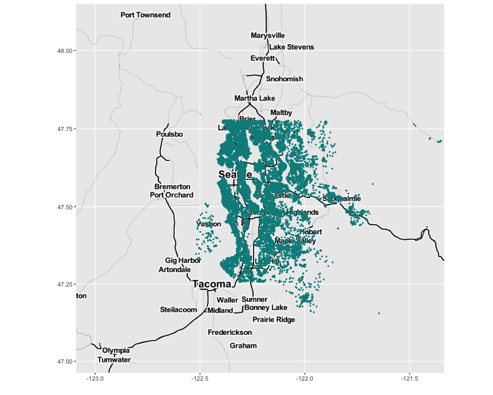

King County House Sales
================
Ashley O’Mahony | [ashleyomahony.com](http://ashleyomahony.com) | May
2019

-----

## King County House Sales Dataset

The *King County House Sales* dataset contains the **house sales in King
County (USA), between May 2014 and May 2015**. The original dataset can
be found on
[Kaggle](https://www.kaggle.com/harlfoxem/housesalesprediction).

All the files of this project are saved in a [GitHub
repository](https://github.com/ashomah/King-County-House-Sales).

The dataset consists in:

  - a Train Set with 17,277 observations with 19 house features, the ID,
    and the price,  
  - a Test Set with 4,320 observations with 19 house features and the
    ID.

This map shows where the properties listed in the dataset are
located:

This project aims to predict the house price based on its features.

 

-----

## Packages

This analysis requires these R packages:

  - Data Cleaning: `tidyr`

  - Plotting: `ggplot2`, `corrplot`, `GGally`, `gridExtra`

  - Statistics: `caret`

These packages are installed and loaded if necessary by the main script.

 

-----

## Data Preparation

The dataset is pretty clean, with no missing value in both Train and
Test sets. A quick look at the `id` values also shows that only a few
houses have been sold more than once on the period, so it doesn’t seem
relevant the consider the `id` and the `date` for this analysis. We will
thus focus on the house features only to predict its price.

    ## [1] "0 columns of the Train Set have NAs."
    ## [1] "1 columns of the Test Set have NAs."
    ## [1] "103 houses sold more than once on the period, for a total of 17173 houses in the Train Set (0.006%)."
    ## [1] "8 houses in the Test Set sold more than once on the period, for a total of 4312 houses in the Test Set (0.002%)."

Some of the features can be converted into factors, as they are not
continuous and help categorizing the house:

  - `waterfront` is a boolean, indicating if the house has a view to a
    waterfront.  
  - `view` indicated the number of times the house has been viewed. As
    it only has 4 values, this feature can be factorized.  
  - `condition` is a score from 1 to 5, indicating the state of the
    house.  
  - `grade` is another score, with 11 levels.  
  - `bedrooms` is typically used to categorize houses.  
  - `bathrooms` could also be used to categorize the houses, although it
    is not clear why the data shows decimal numbers.  
  - `zipcode` is a cluster-like category of the house
location.

 

-----

## Exploratory Data Analysis

