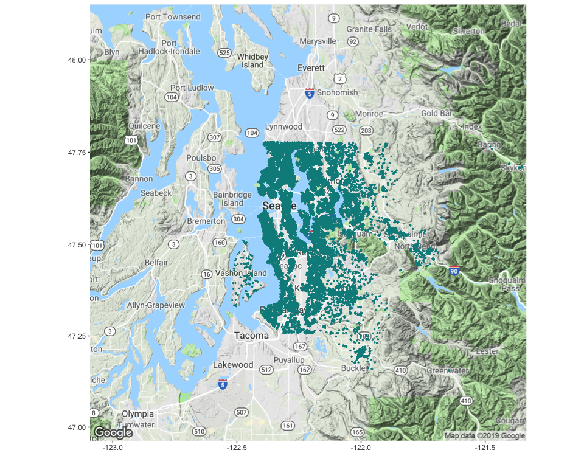

Predicting House Prices
================
Ashley O’Mahony | [ashleyomahony.com](http://ashleyomahony.com) | May
2019

 

-----

## King County House Sales Dataset

The *King County House Sales* dataset contains the **house sales around
Seattle, in King County (USA), between May 2014 and May 2015**. The
original dataset can be found on
[Kaggle](https://www.kaggle.com/harlfoxem/housesalesprediction).

All the files of this project are saved in a [GitHub
repository](https://github.com/ashomah/King-County-House-Sales).

The dataset consists in:

  - **Train Set** with 17,277 observations with 19 house features, the
    ID, and the price.  
  - **Test Set** with 4,320 observations with 19 house features and the
    ID. The `price` column will be added to the Test Set, with NAs, to
    ease the pre-processing stage.

This map shows where the properties listed in the dataset are
located:

This project aims to predict house prices based on their features.

 

-----

## Packages

This analysis requires these R packages:

  - Data Manipulation: `data.table`, `dplyr`, `tibble`, `tidyr`

  - Plotting: `corrplot`, `GGally`, `ggmap`, `ggplot2`, `grid`,
    `gridExtra`

  - Machine Learning: `caret`, `dbscan`, `glmnet`, `leaderCluster`,
    `MLmetrics`, `ranger`, `xgboost`

  - Multithreading: `doMC`, `doParallel`, `factoextra`, `foreach`,
    `parallel`

  - Reporting: `kableExtra`, `knitr`, `RColorBrewer`, `shiny`, and…
    `beepr`.

These packages are installed and loaded if necessary by the main script.

 

-----

## Data Loading

The dataset is pretty clean, with no missing value in both Train and
Test sets. A quick look at the `id` values also shows that only a few
houses have been sold more than once on the period, so it doesn’t seem
relevant the consider the `id` and the `date` for this analysis. We will
thus **focus on the house features** to predict its price.

    ## [1] "0 columns of the Train Set have NAs."
    ## [1] "0 columns of the Test Set have NAs."
    ## [1] "103 houses sold more than once on the period, for a total of 17173 houses in the Train Set (0.006%)."
    ## [1] "8 houses in the Test Set sold more than once on the period, for a total of 4312 houses in the Test Set (0.002%)."

 

Some of the features can be converted into factors, as they are not
continuous and help categorizing the house:

  - `waterfront` is a boolean, indicating if the house has a view to a
    waterfront.  
  - `view` indicated the number of times the house has been viewed. As
    it only has 4 values, this feature can be factorized.  
  - `condition` is a score from 1 to 5, indicating the state of the
    house.  
  - `grade` is another score, with 11 levels.  
  - `bedrooms` is typically used to categorize houses.

 

The package `caret` automatically one-hot encodes the categorical
features when fitting a model. Due to their number of unique values,
these features won’t be factorized at first:

  - `bathrooms` could also be used to categorize the houses, although it
    is not clear why the data shows decimal numbers.  
  - `zipcode` is a cluster-like category of the house location.

The impact of processing them as factors will be tested with a Linear
Regression.

 

-----

## Exploratory Data Analysis

The target of this analysis is the `price` of the houses. Like the real
estate market, the `price` variable is highly right-skewed, with its
maximum value being more than 10 times larger than the 3rd quartile:

    ##    Min. 1st Qu.  Median    Mean 3rd Qu.    Max. 
    ##   78000  320000  450000  539865  645500 7700000

 

These properties of high-value cannot be removed from the dataset, as
they are not anomalies but examples of the luxury market in the region.
By transforming the data with a logarithm to base 10, it is possible to
easily rebalance the dataset. This transformation could be used later to
try to improve our models’
performance.

 

The Correlation Matrix between the numerical features of the Train Set
indicates some correlation between the `price` and:

  - `sqft_living`: more living area logically implies a higher price.  
  - `sqft_living15`: the living area in 2015 is also linked to the
    current price. Recent renovations have modified the living area, but
    it is likely that the house stays in a similar price range.  
  - `sqft_above`: by definition, the area above ground is related to the
    living area. It is not a surprice to see correlation with the price
    as well.  
  - `bathrooms`: interestingly, the number of bathrooms seems to
    slightly correlate with the price.

Some other relationships can be identified:

  - the `sqft_` features are linked to each others, as `sqft_living =
    sqft_above + sqft_basement`, and the lot areas are usually not
    changing much within a year.  
  - the `zipcode` and the `long`itude are quite linked, maybe due to the
    way zipcode have been designed in the
region.

 

This other Correlation Matrix provides another view of the relationship
between features, as well as their own distribution.

 

The following charts allow to understand the structure of each factor
feature:

  - A majority of houses in the region have 3 or 4 bedrooms. An overall
    trend shows that more bedrooms means higher prices.  
  - Most of the houses in the region are in an average condition `3`,
    with 26% of the houses being in a great condition `4`, and 8% being
    in an exceptional condition `5`.  
  - The real estate market in the region seems to offer almost as many
    houses with two floors than with one floor.  
  - The grade distribution is similar than the condition (with more
    levels), but the relation to price looks clearer.  
  - Houses with more views seem to be in a higher price range.  
  - Houses with a view the waterfront are clearly more expensive than
    the ones
without.

 

The following charts describe the numercial features and provide
interesting insights:

  - The number of `bathrooms` is difficult to interpret without knowing
    the meaning of the decimals. But it seems that majority of houses
    have values of 2.5 and 1.  
  - The latitude and longitude distributions suggest a higher number of
    properties in the North-West of the region.  
  - The floor space is also right-skewed, with a large portion of the
    houses having no basement.  
  - Looking at the distribution of the feature `yr_built`, we can
    observe a regular increase of real estate projects since the early
    years of the 20th century. This trend can certainly be related to
    the population growth and the urban development in the region over
    the years.  
  - With only 739 properties with renovation records, the `yr_renovated`
    feature is extremely right-skewed. If we consider only the
    properties with records, renovations go from 1934 till 2015, with
    higher numbers from the 80s, and a big wave of renovations in 2013
    and 2014.  
  - Houses in the dataset seem quite well distributed across the
    `zipcode` range, although it is difficult to comment this feature
    without a good knowlegde of the region and the structure of the
    zipcode
system.

 

-----

## Data Preparation

As the Test Set doesn’t contain the feature `price`, it is necessary to
randomly split the Train Set in two, with a 80|20 ratio:

  - **Train Set A**, which will be used to train our model.  
  - **Train Set B**, which will be used to test our model and validate
    the performance of the model.

These datasets are centered and scaled, using the `preProcess` function
of the package `caret`. These transformations should improve the
performance of linear models.

Copies of these datasets are prepared with the features `bathrooms` and
`zipcode` set as factors, and other copies with the `price` being
transformed with `log10`. These versions of the datasets will allow to
test the response of our models to different inputs.

 

-----

## Cross-Validation Strategy

To validate the stability of our models, we will apply a 10-fold
cross-validation, repeated 3 times.

 

-----

## Baseline

At first, we use the **linear regression** algorithm to fit models on
different dataset configurations:

  - The prepared datasets, without additional transformation,  
  - The prepared datasets with `price` being transformed with log10,  
  - The prepared datasets with `bathrooms` and `zipcode` as factors,  
  - The prepared datasets with both
transformations.

<table class="table table-hover table-condensed" style="margin-left: auto; margin-right: auto;">

<thead>

<tr>

<th style="text-align:right;">

model

</th>

<th style="text-align:right;">

RMSE

</th>

<th style="text-align:right;">

Rsquared

</th>

<th style="text-align:right;">

MAE

</th>

<th style="text-align:right;">

MAPE

</th>

<th style="text-align:right;">

Coefficients

</th>

<th style="text-align:right;">

Train Time (min)

</th>

</tr>

</thead>

<tbody>

<tr>

<td style="text-align:right;">

Baseline Lin.
Reg.

</td>

<td style="text-align:right;">

173375.7

</td>

<td style="text-align:right;">

0.7371931

</td>

<td style="text-align:right;">

115993.74

</td>

<td style="text-align:right;">

0.2340575

</td>

<td style="text-align:right;">

48

</td>

<td style="text-align:right;">

0.1

</td>

</tr>

<tr>

<td style="text-align:right;">

Baseline Lin. Reg.
Log

</td>

<td style="text-align:right;">

167660.5

</td>

<td style="text-align:right;">

0.7542339

</td>

<td style="text-align:right;">

106380.01

</td>

<td style="text-align:right;">

0.1987122

</td>

<td style="text-align:right;">

48

</td>

<td style="text-align:right;">

0.1

</td>

</tr>

<tr>

<td style="text-align:right;">

Baseline Lin. Reg. All
Fact

</td>

<td style="text-align:right;">

132157.4

</td>

<td style="text-align:right;">

0.8472985

</td>

<td style="text-align:right;">

85342.24

</td>

<td style="text-align:right;">

0.1702119

</td>

<td style="text-align:right;">

143

</td>

<td style="text-align:right;">

0.3

</td>

</tr>

<tr>

<td style="text-align:right;">

Baseline Lin. Reg. Log All
Fact

</td>

<td style="text-align:right;">

126177.3

</td>

<td style="text-align:right;">

0.8608053

</td>

<td style="text-align:right;">

74064.56

</td>

<td style="text-align:right;">

0.1394403

</td>

<td style="text-align:right;">

143

</td>

<td style="text-align:right;">

0.3

</td>

</tr>

</tbody>

</table>

The two transformations appear to improve the performance of the model,
both individually and jointly. The log10 helps by centering the ‘price’
and reduce the influence of high values. The class change of `bathrooms`
and `zipcode` avoids the model to consider them as ordinal features,
which is particularly useful for `zipcode` which characterizes house
clusters.

 

We continue by training models with a **random forest** using the
package `ranger`, then with an **eXtreme Gradient BOOSTing** (XGBoost),
both on the four possible combinations of
transformations.

<table class="table table-hover table-condensed" style="margin-left: auto; margin-right: auto;">

<thead>

<tr>

<th style="text-align:left;">

</th>

<th style="text-align:right;">

RMSE

</th>

<th style="text-align:right;">

Rsquared

</th>

<th style="text-align:right;">

MAE

</th>

<th style="text-align:right;">

MAPE

</th>

<th style="text-align:right;">

Coefficients

</th>

<th style="text-align:right;">

Train Time (min)

</th>

</tr>

</thead>

<tbody>

<tr>

<td style="text-align:left;">

Baseline Lin.
Reg.

</td>

<td style="text-align:right;">

173375.7

</td>

<td style="text-align:right;">

0.7371931

</td>

<td style="text-align:right;">

115993.74

</td>

<td style="text-align:right;">

0.2340575

</td>

<td style="text-align:right;">

48

</td>

<td style="text-align:right;">

0.1

</td>

</tr>

<tr>

<td style="text-align:left;">

Baseline Lin. Reg.
Log

</td>

<td style="text-align:right;">

167660.5

</td>

<td style="text-align:right;">

0.7542339

</td>

<td style="text-align:right;">

106380.01

</td>

<td style="text-align:right;">

0.1987122

</td>

<td style="text-align:right;">

48

</td>

<td style="text-align:right;">

0.1

</td>

</tr>

<tr>

<td style="text-align:left;">

Baseline Lin. Reg. All
Fact

</td>

<td style="text-align:right;">

132157.4

</td>

<td style="text-align:right;">

0.8472985

</td>

<td style="text-align:right;">

85342.24

</td>

<td style="text-align:right;">

0.1702119

</td>

<td style="text-align:right;">

143

</td>

<td style="text-align:right;">

0.3

</td>

</tr>

<tr>

<td style="text-align:left;">

Baseline Lin. Reg. Log All
Fact

</td>

<td style="text-align:right;">

126177.3

</td>

<td style="text-align:right;">

0.8608053

</td>

<td style="text-align:right;">

74064.56

</td>

<td style="text-align:right;">

0.1394403

</td>

<td style="text-align:right;">

143

</td>

<td style="text-align:right;">

0.3

</td>

</tr>

<tr>

<td style="text-align:left;">

Baseline
Ranger

</td>

<td style="text-align:right;">

117953.9

</td>

<td style="text-align:right;">

0.8783576

</td>

<td style="text-align:right;">

68898.26

</td>

<td style="text-align:right;">

0.1357399

</td>

<td style="text-align:right;">

47

</td>

<td style="text-align:right;">

26.3

</td>

</tr>

<tr>

<td style="text-align:left;">

Baseline Ranger
Log

</td>

<td style="text-align:right;">

122706.6

</td>

<td style="text-align:right;">

0.8683575

</td>

<td style="text-align:right;">

69140.95

</td>

<td style="text-align:right;">

0.1306257

</td>

<td style="text-align:right;">

47

</td>

<td style="text-align:right;">

26.0

</td>

</tr>

<tr>

<td style="text-align:left;">

Baseline Ranger All
Fact

</td>

<td style="text-align:right;">

114785.7

</td>

<td style="text-align:right;">

0.8848043

</td>

<td style="text-align:right;">

67552.36

</td>

<td style="text-align:right;">

0.1330712

</td>

<td style="text-align:right;">

142

</td>

<td style="text-align:right;">

123.5

</td>

</tr>

<tr>

<td style="text-align:left;">

Baseline Ranger Log All
Fact

</td>

<td style="text-align:right;">

118612.8

</td>

<td style="text-align:right;">

0.8769947

</td>

<td style="text-align:right;">

67751.38

</td>

<td style="text-align:right;">

0.1281304

</td>

<td style="text-align:right;">

142

</td>

<td style="text-align:right;">

122.1

</td>

</tr>

<tr>

<td style="text-align:left;">

Baseline
XGBoost

</td>

<td style="text-align:right;">

116039.2

</td>

<td style="text-align:right;">

0.8822746

</td>

<td style="text-align:right;">

71617.33

</td>

<td style="text-align:right;">

0.1427542

</td>

<td style="text-align:right;">

47

</td>

<td style="text-align:right;">

11.8

</td>

</tr>

<tr>

<td style="text-align:left;">

Baseline XGBoost
Log

</td>

<td style="text-align:right;">

110893.0

</td>

<td style="text-align:right;">

0.8924851

</td>

<td style="text-align:right;">

67756.69

</td>

<td style="text-align:right;">

0.1307163

</td>

<td style="text-align:right;">

47

</td>

<td style="text-align:right;">

11.1

</td>

</tr>

<tr>

<td style="text-align:left;">

Baseline XGBoost All
Fact

</td>

<td style="text-align:right;">

110899.7

</td>

<td style="text-align:right;">

0.8924722

</td>

<td style="text-align:right;">

69604.63

</td>

<td style="text-align:right;">

0.1394589

</td>

<td style="text-align:right;">

142

</td>

<td style="text-align:right;">

33.5

</td>

</tr>

<tr>

<td style="text-align:left;">

Baseline XGBoost Log All
Fact

</td>

<td style="text-align:right;">

109891.8

</td>

<td style="text-align:right;">

0.8944177

</td>

<td style="text-align:right;">

66483.14

</td>

<td style="text-align:right;">

0.1287528

</td>

<td style="text-align:right;">

142

</td>

<td style="text-align:right;">

29.3

</td>

</tr>

</tbody>

</table>

These results confirm our previous conclusions:

  - the log10 transformation has a great impact on the model
    performance. It will be kept for next models.  
  - the class change of `bathrooms` and `zipcode` has lower impact, but
    still improves the results.

Looking at the algorithm performances, *Ranger* has slighlty better
results than *XGBoost*, but the calculation time being significantly
longer for *Ranger*, we will continue with *XGBoost* only.

 

-----

## Feature Engineering

### House Age and Renovation

A few features can be developped, focusing on the `yr_built` and
`yr_renovated` of the house:

  - `house_age`: the difference between the `yr_built` and 2015 gives
    the age of the house.  
  - `house_age_since_renovation`: the difference between the
    `yr_renovated` and 2015 indicates since how many years the house
    hasn’t been renovated.  
  - `renovated`: a boolean flag indicating if the house has been
    renovated at least once.

 

### Clusters

Another element which might influence the price of a house is the
dynamism of the market in the area. Some neighborhoods are more in
demand than others, either because of the price or because of the
reputation. Thus, it would be interesting to add a feature that
considers the density of house sales in the area.

This hexagonal binning map shows the areas with high density of house
sales, which are mainly located in the North-West of the region. Some
other hotspots can be found in the eastern area
too.

 

To identify areas of high house sales density, we will use the
clustering algorithm **DBSCAN** (Density-Based Spatial Clustering of
Application with Noise) from the package `dbscan`. This algorithm groups
points that are closely packed together, and marks as outliers the
points that lie alone in low-density regions.

This algorithm requires two parameters:

  - `eps` - *epsilon*: defines the radius of neigborhood around a point
    `x` (reachability maximum distance).  
  - `minPts`: defines the minimum number of neighbors within epsilon
    radius. If the point `x` is not surrounded by `minPts` neighbors, it
    is considered as an outlier.

After multiple trials, it appeared that the parameters providing a
maximum number of relevant clusters were `eps = 0.0114` and `minPts
= 50`. This plot shows which areas have been defined as high-density
clusters, using the Train Set
A.

 

The clusters now being found based on *Train Set A*, we can asociate
them to the points of *Train Set B*. The maps below allow to compare the
results and confirm that the points of *Train Set B* are assigned to the
right
cluster.

 

With these new features, we can train a new model and compare the
results with the previous
ones.

<table class="table table-hover table-condensed" style="margin-left: auto; margin-right: auto;">

<thead>

<tr>

<th style="text-align:left;">

</th>

<th style="text-align:right;">

RMSE

</th>

<th style="text-align:right;">

Rsquared

</th>

<th style="text-align:right;">

MAE

</th>

<th style="text-align:right;">

MAPE

</th>

<th style="text-align:right;">

Coefficients

</th>

<th style="text-align:right;">

Train Time (min)

</th>

</tr>

</thead>

<tbody>

<tr>

<td style="text-align:left;">

Baseline Ranger
Log

</td>

<td style="text-align:right;">

122706.6

</td>

<td style="text-align:right;">

0.8683575

</td>

<td style="text-align:right;">

69140.95

</td>

<td style="text-align:right;">

0.1306257

</td>

<td style="text-align:right;">

47

</td>

<td style="text-align:right;">

26.0

</td>

</tr>

<tr>

<td style="text-align:left;">

Baseline Ranger Log All
Fact

</td>

<td style="text-align:right;">

118612.8

</td>

<td style="text-align:right;">

0.8769947

</td>

<td style="text-align:right;">

67751.38

</td>

<td style="text-align:right;">

0.1281304

</td>

<td style="text-align:right;">

142

</td>

<td style="text-align:right;">

122.1

</td>

</tr>

<tr>

<td style="text-align:left;">

Baseline XGBoost Log All
Fact

</td>

<td style="text-align:right;">

109891.8

</td>

<td style="text-align:right;">

0.8944177

</td>

<td style="text-align:right;">

66483.14

</td>

<td style="text-align:right;">

0.1287528

</td>

<td style="text-align:right;">

142

</td>

<td style="text-align:right;">

29.3

</td>

</tr>

<tr>

<td style="text-align:left;">

FE
XGBoost

</td>

<td style="text-align:right;">

119055.1

</td>

<td style="text-align:right;">

0.8760756

</td>

<td style="text-align:right;">

67999.89

</td>

<td style="text-align:right;">

0.1299648

</td>

<td style="text-align:right;">

190

</td>

<td style="text-align:right;">

40.9

</td>

</tr>

</tbody>

</table>

 

The new model obtains a reasonable result, although it didn’t beat the
two best models.

 

-----

## Feature Selection with Lasso and RFE

We can compare the Top 20 feature importances for the 4 best models, and
observe some similarities:

  - `lat` and `long` appear in all four Top 20, with `lat` having a
    really high importance. It might indicate that the house prices
    depend a lot on the location on the North-South axis.  
  - `sqft_living` and its related features `sqft_above`, `sqft_living15`
    are also at the top of the list, which is not really surprising.  
  - `grade` values are important, especially the higher ones. It might
    indicate that higher grades have a significant impact on the house
    price.  
  - `yr_built` usually appears at the first tier of the Top 20s.  
  - As a great indicator of the house location, the `zipcode` seems to
    have some kind of importance. `zipcode98004` and `zipcode98112` in
    particular appear in the Top 20. These neighborhoods might have
    specific characteristics which influence the prices.  
  - `waterfront` appears in the four Top 20, which might be a great
    add-value for properties in this area.  
  - `condition3`, which indicate that the house in a fair condition,
    seems to impact the price as well.  
  - `view4` has also an influence on the price. It could indicate lower
    prices, due to the difficulty to find a buyer. Or in the opposite,
    it could indicate prices higher than the market. A better look at
    the models structures will give us better
insights.

 

### Lasso Regression

With 190 features, the model resulting from the Feature Engineering
stage is quite complex and would benefit from cutting down its number of
variables. Also, only a few parameters seem to have a real importance
for the model result. Thus, we will start our trimming process with a
**Lasso Regression** which is forcing the coefficients with minor
contribution to be equal to 0. We will then get a list of features that
we can ignore for our
    model.

    ## [1] "The Lasso Regression selected 188 variables, and rejected 12 variables."

<table class="table table-hover table-condensed" style="margin-left: auto; margin-right: auto;">

<thead>

<tr>

<th style="text-align:left;">

Rejected Features

</th>

<th style="text-align:left;">

</th>

<th style="text-align:left;">

</th>

<th style="text-align:left;">

</th>

</tr>

</thead>

<tbody>

<tr>

<td style="text-align:left;">

bedrooms.3

</td>

<td style="text-align:left;">

bathrooms.5.5

</td>

<td style="text-align:left;">

view.2

</td>

<td style="text-align:left;">

renovated.0

</td>

</tr>

<tr>

<td style="text-align:left;">

bathrooms.3

</td>

<td style="text-align:left;">

bathrooms.7.5

</td>

<td style="text-align:left;">

condition.4

</td>

<td style="text-align:left;">

renovated.1

</td>

</tr>

<tr>

<td style="text-align:left;">

bathrooms.4.5

</td>

<td style="text-align:left;">

waterfront.1

</td>

<td style="text-align:left;">

grade.8

</td>

<td style="text-align:left;">

cluster.10

</td>

</tr>

</tbody>

</table>

 

We can note that the new feature `renovated` has been rejected all
together. Large values of `bathrooms` also don’t seem to have any impact
on the price.

 

### Recursive Feature Elimination

The dataset being lightened from a few features, we continue the feature
selection using a **RFE** (Recursive Feature Elimination), which will
test the variable importances for models trained on subsets with
predefined number of variables. This should help to reduce the number of
variables with a low impact on the model performance.

For this RFE, we use *Random Forest* algorithms and *5-fold
Cross-Validation*. This chart shows the RMSE obtained for each iteration
of the
RFE.

###### *Note: the RMSE hasn’t been rescaled, which explains the difference with the table of model results.*

 

Although we can’t observe any clear ‘knee’, which would indicate that
many features could be eliminated with a low impact on the model
performance, we could expect to get a fair result for subsets of 40 to
60 features. It is here difficult to estimate the impact on the metrics,
as the RMSE shown here is re-scalled.

If we look at the variables importance, we can see that 4 features have
a great impact on the model performance, while the importance then
decreases slowly to be almost insignificant after the 25th
feature.

 

By defining an arbitrary threshold, we can filter the features with low
importance. We decide that features that have an importance less than
0.1% overall should be eliminated. We end up with a list of 37 features
which cumulate 96.8% of the variable importances. We can expect a low
impact on the model performance, which could be recaptured with model
fine
tuning.

<table class="table table-hover table-condensed" style="margin-left: auto; margin-right: auto;">

<thead>

<tr>

<th style="text-align:left;">

Selected Features

</th>

<th style="text-align:left;">

</th>

<th style="text-align:left;">

</th>

<th style="text-align:left;">

</th>

<th style="text-align:left;">

</th>

</tr>

</thead>

<tbody>

<tr>

<td style="text-align:left;">

zipcode.98040

</td>

<td style="text-align:left;">

grade.12

</td>

<td style="text-align:left;">

grade.5

</td>

<td style="text-align:left;">

zipcode.98106

</td>

<td style="text-align:left;">

bedrooms.2

</td>

</tr>

<tr>

<td style="text-align:left;">

bedrooms.4

</td>

<td style="text-align:left;">

condition.2

</td>

<td style="text-align:left;">

cluster.2

</td>

<td style="text-align:left;">

yr\_renovated

</td>

<td style="text-align:left;">

cluster.0

</td>

</tr>

<tr>

<td style="text-align:left;">

zipcode.98112

</td>

<td style="text-align:left;">

floors.2

</td>

<td style="text-align:left;">

cluster.31

</td>

<td style="text-align:left;">

condition.3

</td>

<td style="text-align:left;">

floors.1

</td>

</tr>

<tr>

<td style="text-align:left;">

view.4

</td>

<td style="text-align:left;">

waterfront.0

</td>

<td style="text-align:left;">

grade.11

</td>

<td style="text-align:left;">

zipcode.98004

</td>

<td style="text-align:left;">

grade.9

</td>

</tr>

<tr>

<td style="text-align:left;">

grade.6

</td>

<td style="text-align:left;">

grade.10

</td>

<td style="text-align:left;">

age\_renovation

</td>

<td style="text-align:left;">

sqft\_basement

</td>

<td style="text-align:left;">

cluster.1

</td>

</tr>

<tr>

<td style="text-align:left;">

house\_age

</td>

<td style="text-align:left;">

yr\_built

</td>

<td style="text-align:left;">

bathrooms.1

</td>

<td style="text-align:left;">

view.0

</td>

<td style="text-align:left;">

sqft\_lot

</td>

</tr>

<tr>

<td style="text-align:left;">

sqft\_lot15

</td>

<td style="text-align:left;">

grade.7

</td>

<td style="text-align:left;">

long

</td>

<td style="text-align:left;">

sqft\_above

</td>

<td style="text-align:left;">

sqft\_living15

</td>

</tr>

<tr>

<td style="text-align:left;">

sqft\_living

</td>

<td style="text-align:left;">

lat

</td>

<td style="text-align:left;">

</td>

<td style="text-align:left;">

</td>

<td style="text-align:left;">

</td>

</tr>

</tbody>

</table>

 

Using this list of selected features, we can re-train an **XGBoost**
model and compare it with previous
results.

<table class="table table-hover table-condensed" style="margin-left: auto; margin-right: auto;">

<thead>

<tr>

<th style="text-align:right;">

model

</th>

<th style="text-align:right;">

RMSE

</th>

<th style="text-align:right;">

Rsquared

</th>

<th style="text-align:right;">

MAE

</th>

<th style="text-align:right;">

MAPE

</th>

<th style="text-align:right;">

Coefficients

</th>

<th style="text-align:right;">

Train Time (min)

</th>

</tr>

</thead>

<tbody>

<tr>

<td style="text-align:right;">

Baseline Ranger
Log

</td>

<td style="text-align:right;">

122706.6

</td>

<td style="text-align:right;">

0.8683575

</td>

<td style="text-align:right;">

69140.95

</td>

<td style="text-align:right;">

0.1306257

</td>

<td style="text-align:right;">

47

</td>

<td style="text-align:right;">

26.0

</td>

</tr>

<tr>

<td style="text-align:right;">

Baseline Ranger Log All
Fact

</td>

<td style="text-align:right;">

118612.8

</td>

<td style="text-align:right;">

0.8769947

</td>

<td style="text-align:right;">

67751.38

</td>

<td style="text-align:right;">

0.1281304

</td>

<td style="text-align:right;">

142

</td>

<td style="text-align:right;">

122.1

</td>

</tr>

<tr>

<td style="text-align:right;">

Baseline XGBoost Log All
Fact

</td>

<td style="text-align:right;">

109891.8

</td>

<td style="text-align:right;">

0.8944177

</td>

<td style="text-align:right;">

66483.14

</td>

<td style="text-align:right;">

0.1287528

</td>

<td style="text-align:right;">

142

</td>

<td style="text-align:right;">

29.3

</td>

</tr>

<tr>

<td style="text-align:right;">

FE
XGBoost

</td>

<td style="text-align:right;">

119055.1

</td>

<td style="text-align:right;">

0.8760756

</td>

<td style="text-align:right;">

67999.89

</td>

<td style="text-align:right;">

0.1299648

</td>

<td style="text-align:right;">

190

</td>

<td style="text-align:right;">

40.9

</td>

</tr>

<tr>

<td style="text-align:right;">

XGBoost Post
RFE

</td>

<td style="text-align:right;">

118315.5

</td>

<td style="text-align:right;">

0.8776106

</td>

<td style="text-align:right;">

69053.40

</td>

<td style="text-align:right;">

0.1323090

</td>

<td style="text-align:right;">

37

</td>

<td style="text-align:right;">

9.4

</td>

</tr>

</tbody>

</table>

 

The performance of the model post-RFE is not as good as the previous
models, but with only 37 features, it is still a very good score\! We
should be able to catch-up on results with some model tuning.

 

-----

## Tuning

After subsetting the features selected by the Lasso and RFE steps, we
proceed to model tuning on a **XGBoost** and a **Ranger**, to see which
one provides the best results.

Starting with the *XGBoost*, we use a *Tune Grid* to fine best
combination of
parameters.

 

These charts don’t reveal any opportunity to easily improve the result
of the parameters we already tested. Thus, we can approve the best model
from this search, which used these
parameters:

<table class="table table-hover table-condensed" style="margin-left: auto; margin-right: auto;">

<thead>

<tr>

<th style="text-align:center;">

nrounds

</th>

<th style="text-align:center;">

max\_depth

</th>

<th style="text-align:center;">

eta

</th>

<th style="text-align:center;">

gamma

</th>

<th style="text-align:center;">

colsample\_bytree

</th>

<th style="text-align:center;">

min\_child\_weight

</th>

<th style="text-align:center;">

subsample

</th>

</tr>

</thead>

<tbody>

<tr>

<td style="text-align:center;">

900

</td>

<td style="text-align:center;">

4

</td>

<td style="text-align:center;">

0.1

</td>

<td style="text-align:center;">

0

</td>

<td style="text-align:center;">

1

</td>

<td style="text-align:center;">

3

</td>

<td style="text-align:center;">

1

</td>

</tr>

</tbody>

</table>

 

Trying now with a *Ranger* algorithm, which provided really good results
before Feature
Engineering.

 

These charts don’t reveal any opportunity to easily improve the result.
We might actually have pushed a bit much on the `mtry` parameter.
Anyway, we can approve the best model from this search, which used these
parameters:

<table class="table table-hover table-condensed" style="margin-left: auto; margin-right: auto;">

<thead>

<tr>

<th style="text-align:center;">

mtry

</th>

<th style="text-align:center;">

splitrule

</th>

<th style="text-align:center;">

min.node.size

</th>

</tr>

</thead>

<tbody>

<tr>

<td style="text-align:center;">

10

</td>

<td style="text-align:center;">

variance

</td>

<td style="text-align:center;">

1

</td>

</tr>

</tbody>

</table>

 

Let’s compare these two new models with the previous best
ones.

<table class="table table-hover table-condensed" style="margin-left: auto; margin-right: auto;">

<thead>

<tr>

<th style="text-align:right;">

model

</th>

<th style="text-align:right;">

RMSE

</th>

<th style="text-align:right;">

Rsquared

</th>

<th style="text-align:right;">

MAE

</th>

<th style="text-align:right;">

MAPE

</th>

<th style="text-align:right;">

Coefficients

</th>

<th style="text-align:right;">

Train Time (min)

</th>

</tr>

</thead>

<tbody>

<tr>

<td style="text-align:right;">

Baseline Ranger
Log

</td>

<td style="text-align:right;">

122706.6

</td>

<td style="text-align:right;">

0.8683575

</td>

<td style="text-align:right;">

69140.95

</td>

<td style="text-align:right;">

0.1306257

</td>

<td style="text-align:right;">

47

</td>

<td style="text-align:right;">

26.0

</td>

</tr>

<tr>

<td style="text-align:right;">

Baseline Ranger Log All
Fact

</td>

<td style="text-align:right;">

118612.8

</td>

<td style="text-align:right;">

0.8769947

</td>

<td style="text-align:right;">

67751.38

</td>

<td style="text-align:right;">

0.1281304

</td>

<td style="text-align:right;">

142

</td>

<td style="text-align:right;">

122.1

</td>

</tr>

<tr>

<td style="text-align:right;">

Baseline XGBoost Log All
Fact

</td>

<td style="text-align:right;">

109891.8

</td>

<td style="text-align:right;">

0.8944177

</td>

<td style="text-align:right;">

66483.14

</td>

<td style="text-align:right;">

0.1287528

</td>

<td style="text-align:right;">

142

</td>

<td style="text-align:right;">

29.3

</td>

</tr>

<tr>

<td style="text-align:right;">

FE
XGBoost

</td>

<td style="text-align:right;">

119055.1

</td>

<td style="text-align:right;">

0.8760756

</td>

<td style="text-align:right;">

67999.89

</td>

<td style="text-align:right;">

0.1299648

</td>

<td style="text-align:right;">

190

</td>

<td style="text-align:right;">

40.9

</td>

</tr>

<tr>

<td style="text-align:right;">

XGBoost Post
RFE

</td>

<td style="text-align:right;">

118315.5

</td>

<td style="text-align:right;">

0.8776106

</td>

<td style="text-align:right;">

69053.40

</td>

<td style="text-align:right;">

0.1323090

</td>

<td style="text-align:right;">

37

</td>

<td style="text-align:right;">

9.4

</td>

</tr>

<tr>

<td style="text-align:right;">

Tuning
XGBoost

</td>

<td style="text-align:right;">

112054.8

</td>

<td style="text-align:right;">

0.8902204

</td>

<td style="text-align:right;">

64687.33

</td>

<td style="text-align:right;">

0.1253911

</td>

<td style="text-align:right;">

37

</td>

<td style="text-align:right;">

73.3

</td>

</tr>

<tr>

<td style="text-align:right;">

Tuning
Ranger

</td>

<td style="text-align:right;">

121960.2

</td>

<td style="text-align:right;">

0.8699540

</td>

<td style="text-align:right;">

69505.40

</td>

<td style="text-align:right;">

0.1316731

</td>

<td style="text-align:right;">

37

</td>

<td style="text-align:right;">

34.2

</td>

</tr>

</tbody>

</table>

 

The **Tuned XGBoost** performs very well, outperforming the previous
records\! The Tuned Ranger, on the other hand, is a bit disappointing,
as it is actually worse than the *Baseline Ranger with Log10(`price`)*…

 

-----

## Final Model

The best model for this analysis is the **Tuned XGBoost**, which reaches
the *MAPE* score of 0.1253911 with only 37
features.

<table class="table table-hover table-condensed" style="margin-left: auto; margin-right: auto;">

<thead>

<tr>

<th style="text-align:right;">

model

</th>

<th style="text-align:right;">

RMSE

</th>

<th style="text-align:right;">

Rsquared

</th>

<th style="text-align:right;">

MAE

</th>

<th style="text-align:right;">

MAPE

</th>

<th style="text-align:right;">

Coefficients

</th>

<th style="text-align:right;">

Train Time (min)

</th>

</tr>

</thead>

<tbody>

<tr>

<td style="text-align:right;">

Tuning
XGBoost

</td>

<td style="text-align:right;">

112054.8

</td>

<td style="text-align:right;">

0.8902204

</td>

<td style="text-align:right;">

64687.33

</td>

<td style="text-align:right;">

0.1253911

</td>

<td style="text-align:right;">

37

</td>

<td style="text-align:right;">

73.3

</td>

</tr>

</tbody>

</table>

The model uses these
parameters:

<table class="table table-hover table-condensed" style="margin-left: auto; margin-right: auto;">

<thead>

<tr>

<th style="text-align:center;">

nrounds

</th>

<th style="text-align:center;">

max\_depth

</th>

<th style="text-align:center;">

eta

</th>

<th style="text-align:center;">

gamma

</th>

<th style="text-align:center;">

colsample\_bytree

</th>

<th style="text-align:center;">

min\_child\_weight

</th>

<th style="text-align:center;">

subsample

</th>

</tr>

</thead>

<tbody>

<tr>

<td style="text-align:center;">

900

</td>

<td style="text-align:center;">

4

</td>

<td style="text-align:center;">

0.1

</td>

<td style="text-align:center;">

0

</td>

<td style="text-align:center;">

1

</td>

<td style="text-align:center;">

3

</td>

<td style="text-align:center;">

1

</td>

</tr>

</tbody>

</table>

 

The model needs these features as
input:

<table class="table table-hover table-condensed" style="margin-left: auto; margin-right: auto;">

<thead>

<tr>

<th style="text-align:left;">

Features

</th>

<th style="text-align:left;">

</th>

<th style="text-align:left;">

</th>

<th style="text-align:left;">

</th>

<th style="text-align:left;">

</th>

</tr>

</thead>

<tbody>

<tr>

<td style="text-align:left;">

zipcode.98040

</td>

<td style="text-align:left;">

grade.12

</td>

<td style="text-align:left;">

grade.5

</td>

<td style="text-align:left;">

zipcode.98106

</td>

<td style="text-align:left;">

bedrooms.2

</td>

</tr>

<tr>

<td style="text-align:left;">

bedrooms.4

</td>

<td style="text-align:left;">

condition.2

</td>

<td style="text-align:left;">

cluster.2

</td>

<td style="text-align:left;">

yr\_renovated

</td>

<td style="text-align:left;">

cluster.0

</td>

</tr>

<tr>

<td style="text-align:left;">

zipcode.98112

</td>

<td style="text-align:left;">

floors.2

</td>

<td style="text-align:left;">

cluster.31

</td>

<td style="text-align:left;">

condition.3

</td>

<td style="text-align:left;">

floors.1

</td>

</tr>

<tr>

<td style="text-align:left;">

view.4

</td>

<td style="text-align:left;">

waterfront.0

</td>

<td style="text-align:left;">

grade.11

</td>

<td style="text-align:left;">

zipcode.98004

</td>

<td style="text-align:left;">

grade.9

</td>

</tr>

<tr>

<td style="text-align:left;">

grade.6

</td>

<td style="text-align:left;">

grade.10

</td>

<td style="text-align:left;">

age\_renovation

</td>

<td style="text-align:left;">

sqft\_basement

</td>

<td style="text-align:left;">

cluster.1

</td>

</tr>

<tr>

<td style="text-align:left;">

house\_age

</td>

<td style="text-align:left;">

yr\_built

</td>

<td style="text-align:left;">

bathrooms.1

</td>

<td style="text-align:left;">

view.0

</td>

<td style="text-align:left;">

sqft\_lot

</td>

</tr>

<tr>

<td style="text-align:left;">

sqft\_lot15

</td>

<td style="text-align:left;">

grade.7

</td>

<td style="text-align:left;">

long

</td>

<td style="text-align:left;">

sqft\_above

</td>

<td style="text-align:left;">

sqft\_living15

</td>

</tr>

<tr>

<td style="text-align:left;">

sqft\_living

</td>

<td style="text-align:left;">

lat

</td>

<td style="text-align:left;">

</td>

<td style="text-align:left;">

</td>

<td style="text-align:left;">

</td>

</tr>

</tbody>

</table>

 

Comparing the predictions of our model with the actual values of the
*Train Set B* would provide an idea of its limitations. We can notice
that the model has **difficulties to predict prices between 0.75 and 1
million dollars**. Further work on Feature Engineering might be able to
improve the results in this
area.

 

These charts provide different views of the model residuals, which allow
to identify possible characteristics of the data which might not be well
modeled. We can see that overall, the residuals look normaly
distributed, but there might be some possible improvements, as some
outliers can be seen on the scatterplot and on the boxplot, and the
QQplot displays a ‘wavy’ line insteand of a straight
one.

 

The model now needs to be applied on the *Test Set*, for which we
haven’t the actual prices in this analysis. All the metrics mentioned
in this report only apply to the *Train Set B*. Applying the model on
the *Test Set* will allow to validate if the model is relevant with
unknown
data.

   

-----

## Annexe - All Models and Results

<table class="table table-hover table-condensed" style="margin-left: auto; margin-right: auto;">

<thead>

<tr>

<th style="text-align:right;">

model

</th>

<th style="text-align:right;">

RMSE

</th>

<th style="text-align:right;">

Rsquared

</th>

<th style="text-align:right;">

MAE

</th>

<th style="text-align:right;">

MAPE

</th>

<th style="text-align:right;">

Coefficients

</th>

<th style="text-align:right;">

Train Time (min)

</th>

</tr>

</thead>

<tbody>

<tr>

<td style="text-align:right;">

Baseline Lin.
Reg.

</td>

<td style="text-align:right;">

173375.7

</td>

<td style="text-align:right;">

0.7371931

</td>

<td style="text-align:right;">

115993.74

</td>

<td style="text-align:right;">

0.2340575

</td>

<td style="text-align:right;">

48

</td>

<td style="text-align:right;">

0.1

</td>

</tr>

<tr>

<td style="text-align:right;">

Baseline Lin. Reg.
Log

</td>

<td style="text-align:right;">

167660.5

</td>

<td style="text-align:right;">

0.7542339

</td>

<td style="text-align:right;">

106380.01

</td>

<td style="text-align:right;">

0.1987122

</td>

<td style="text-align:right;">

48

</td>

<td style="text-align:right;">

0.1

</td>

</tr>

<tr>

<td style="text-align:right;">

Baseline Lin. Reg. All
Fact

</td>

<td style="text-align:right;">

132157.4

</td>

<td style="text-align:right;">

0.8472985

</td>

<td style="text-align:right;">

85342.24

</td>

<td style="text-align:right;">

0.1702119

</td>

<td style="text-align:right;">

143

</td>

<td style="text-align:right;">

0.3

</td>

</tr>

<tr>

<td style="text-align:right;">

Baseline Lin. Reg. Log All
Fact

</td>

<td style="text-align:right;">

126177.3

</td>

<td style="text-align:right;">

0.8608053

</td>

<td style="text-align:right;">

74064.56

</td>

<td style="text-align:right;">

0.1394403

</td>

<td style="text-align:right;">

143

</td>

<td style="text-align:right;">

0.3

</td>

</tr>

<tr>

<td style="text-align:right;">

Baseline
Ranger

</td>

<td style="text-align:right;">

117953.9

</td>

<td style="text-align:right;">

0.8783576

</td>

<td style="text-align:right;">

68898.26

</td>

<td style="text-align:right;">

0.1357399

</td>

<td style="text-align:right;">

47

</td>

<td style="text-align:right;">

26.3

</td>

</tr>

<tr>

<td style="text-align:right;">

Baseline Ranger
Log

</td>

<td style="text-align:right;">

122706.6

</td>

<td style="text-align:right;">

0.8683575

</td>

<td style="text-align:right;">

69140.95

</td>

<td style="text-align:right;">

0.1306257

</td>

<td style="text-align:right;">

47

</td>

<td style="text-align:right;">

26.0

</td>

</tr>

<tr>

<td style="text-align:right;">

Baseline Ranger All
Fact

</td>

<td style="text-align:right;">

114785.7

</td>

<td style="text-align:right;">

0.8848043

</td>

<td style="text-align:right;">

67552.36

</td>

<td style="text-align:right;">

0.1330712

</td>

<td style="text-align:right;">

142

</td>

<td style="text-align:right;">

123.5

</td>

</tr>

<tr>

<td style="text-align:right;">

Baseline Ranger Log All
Fact

</td>

<td style="text-align:right;">

118612.8

</td>

<td style="text-align:right;">

0.8769947

</td>

<td style="text-align:right;">

67751.38

</td>

<td style="text-align:right;">

0.1281304

</td>

<td style="text-align:right;">

142

</td>

<td style="text-align:right;">

122.1

</td>

</tr>

<tr>

<td style="text-align:right;">

Baseline
XGBoost

</td>

<td style="text-align:right;">

116039.2

</td>

<td style="text-align:right;">

0.8822746

</td>

<td style="text-align:right;">

71617.33

</td>

<td style="text-align:right;">

0.1427542

</td>

<td style="text-align:right;">

47

</td>

<td style="text-align:right;">

11.8

</td>

</tr>

<tr>

<td style="text-align:right;">

Baseline XGBoost
Log

</td>

<td style="text-align:right;">

110893.0

</td>

<td style="text-align:right;">

0.8924851

</td>

<td style="text-align:right;">

67756.69

</td>

<td style="text-align:right;">

0.1307163

</td>

<td style="text-align:right;">

47

</td>

<td style="text-align:right;">

11.1

</td>

</tr>

<tr>

<td style="text-align:right;">

Baseline XGBoost All
Fact

</td>

<td style="text-align:right;">

110899.7

</td>

<td style="text-align:right;">

0.8924722

</td>

<td style="text-align:right;">

69604.63

</td>

<td style="text-align:right;">

0.1394589

</td>

<td style="text-align:right;">

142

</td>

<td style="text-align:right;">

33.5

</td>

</tr>

<tr>

<td style="text-align:right;">

Baseline XGBoost Log All
Fact

</td>

<td style="text-align:right;">

109891.8

</td>

<td style="text-align:right;">

0.8944177

</td>

<td style="text-align:right;">

66483.14

</td>

<td style="text-align:right;">

0.1287528

</td>

<td style="text-align:right;">

142

</td>

<td style="text-align:right;">

29.3

</td>

</tr>

<tr>

<td style="text-align:right;">

FE
XGBoost

</td>

<td style="text-align:right;">

119055.1

</td>

<td style="text-align:right;">

0.8760756

</td>

<td style="text-align:right;">

67999.89

</td>

<td style="text-align:right;">

0.1299648

</td>

<td style="text-align:right;">

190

</td>

<td style="text-align:right;">

40.9

</td>

</tr>

<tr>

<td style="text-align:right;">

FE XGBoost
Clusters

</td>

<td style="text-align:right;">

113018.6

</td>

<td style="text-align:right;">

0.8883238

</td>

<td style="text-align:right;">

70184.98

</td>

<td style="text-align:right;">

0.1397804

</td>

<td style="text-align:right;">

48

</td>

<td style="text-align:right;">

13.2

</td>

</tr>

<tr>

<td style="text-align:right;">

FE XGBoost Clusters
Fact

</td>

<td style="text-align:right;">

115534.0

</td>

<td style="text-align:right;">

0.8832976

</td>

<td style="text-align:right;">

71665.63

</td>

<td style="text-align:right;">

0.1415128

</td>

<td style="text-align:right;">

92

</td>

<td style="text-align:right;">

22.3

</td>

</tr>

<tr>

<td style="text-align:right;">

FE XGBoost Clusters All
Fact

</td>

<td style="text-align:right;">

114216.9

</td>

<td style="text-align:right;">

0.8859432

</td>

<td style="text-align:right;">

70396.77

</td>

<td style="text-align:right;">

0.1395339

</td>

<td style="text-align:right;">

187

</td>

<td style="text-align:right;">

43.9

</td>

</tr>

<tr>

<td style="text-align:right;">

XGBoost Post
RFE

</td>

<td style="text-align:right;">

118315.5

</td>

<td style="text-align:right;">

0.8776106

</td>

<td style="text-align:right;">

69053.40

</td>

<td style="text-align:right;">

0.1323090

</td>

<td style="text-align:right;">

37

</td>

<td style="text-align:right;">

9.4

</td>

</tr>

<tr>

<td style="text-align:right;">

Tuning
XGBoost

</td>

<td style="text-align:right;">

112054.8

</td>

<td style="text-align:right;">

0.8902204

</td>

<td style="text-align:right;">

64687.33

</td>

<td style="text-align:right;">

0.1253911

</td>

<td style="text-align:right;">

37

</td>

<td style="text-align:right;">

73.3

</td>

</tr>

<tr>

<td style="text-align:right;">

Tuning
Ranger

</td>

<td style="text-align:right;">

121960.2

</td>

<td style="text-align:right;">

0.8699540

</td>

<td style="text-align:right;">

69505.40

</td>

<td style="text-align:right;">

0.1316731

</td>

<td style="text-align:right;">

37

</td>

<td style="text-align:right;">

34.2

</td>

</tr>

</tbody>

</table>

  

-----

###### *Ashley O’Mahony | [ashleyomahony.com](http://ashleyomahony.com) | May 2019*

-----
